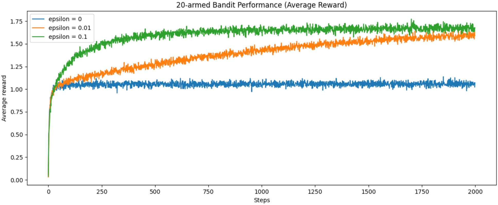
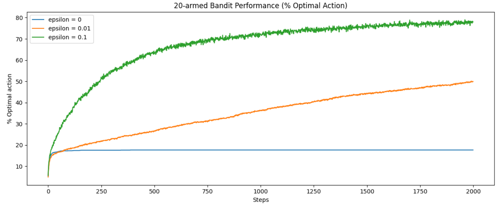

# epsilon-greedy-bandit-simulation
Simulation study of the epsilon-greedy strategy in the multi-armed bandit problem, analysing exploration–exploitation trade-offs.

---

## Project Overview

This project explores the epsilon-greedy strategy in the multi-armed bandit problem.  
The goal is to study how different epsilon values affect the balance between exploration and exploitation.

Through simulation experiments, we compare how agents perform under different levels of randomness and analyze their learning behavior over time.

---

## Problem Description

The multi-armed bandit problem is a classic reinforcement learning task.  
An agent repeatedly selects one action from multiple options (arms), each with an unknown reward distribution.

The challenge is to:

- **Explore** different actions to gather information
- **Exploit** the best-known action to maximize reward

The epsilon-greedy strategy addresses this trade-off by:

- Choosing a random action with probability ε (exploration)
- Choosing the best current action with probability 1 - ε (exploitation)

---

## Methodology

- Simulated a k-armed bandit environment
- Implemented the epsilon-greedy algorithm
- Compared performance under different epsilon values
- Evaluated:
  - Average reward over time
  - Optimal action selection percentage

---

## Results

The experiments demonstrate that:

- Smaller epsilon values tend to produce more stable long-term performance.
- Larger epsilon values encourage exploration but may reduce short-term reward.
- An appropriate balance between exploration and exploitation is essential for efficient learning.

### Average Reward Comparison

### Optimal Action Selection Rate

These results clearly show how exploration intensity influences both reward accumulation and policy convergence.

---

## Technologies Used

- Python
- NumPy
- Matplotlib
- Jupyter Notebook

---
